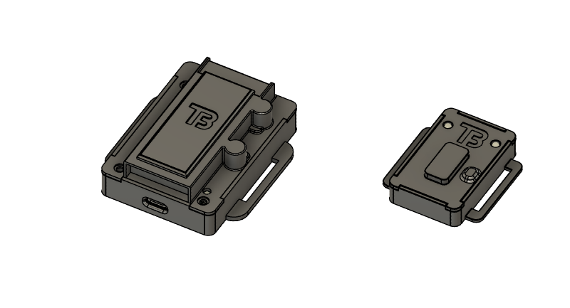

# BODY TRACKER  
  
自作のトラッカーです．[SlimeVR](https://github.com/SlimeVR/SlimeVR-Server)を使用します．  
データの取得方法で迷走して，完成まで2か月くらいかかりました．  
ドリフトの時間サイクルは体感30分程度です．  

## 概要  
**LSM6DSV16X** のSFLPで出力されたクオータニオンを **ESP32-WROOM-32E** でI2C経由で拾ってSlimeVRに送信します．  

このトラッカーはマスターとスレーブの2個セットで製作されており，このセンサーを複数セット製作し接続することで，トラッキング箇所を自由に増やすことができます．  

詳細の仕様についてのドキュメントは[こちら](docs/overview.md)をご覧ください．  
製作手順については[こちら](docs/setup.md)をご覧ください．  

## 免責
本プロジェクトは以下の外部ソフトウェア・環境を利用しています．  
本リポジトリ内に同包はしていません．  
  
- SlimeVR Server  
[SlimeVR Server リポジトリ](https://github.com/SlimeVR/SlimeVR-Server)  
*本プロジェクトはSlimeVRのシステムと互換性を持つよう設計されていますが，SlimeVRチームによって作成，提供，または承認されたものではありません．*  
*「SlimeVR」は，SlimeVR BVの商標または登録商標です．*  
  
- Arduino  
[Arduino.cc](https://www.arduino.cc/)  
*本プロジェクトはArduino環境を利用していますが，Arduino公式プロジェクトとは無関係です．*  
*「Arduino(R)」は，Arduino Srlの商標または登録商標です．*