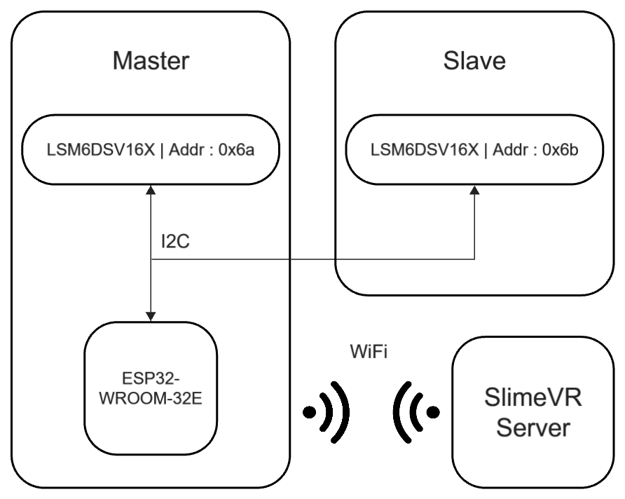

# OVERVIEW
トラッカーに関する詳細ドキュメントです．

## 全体
VRChatで使用することを前提として作成した，ボディートラッカーのセンサー2個セットです．
モバイルバッテリー等の5V供給が出来るUSB電源を使用することで動作させることができます．

製作する際は，[トラッカーの作り方](setup.md)を一読してください．製作手順と注意事項等が書いてあります．

### 使用モジュール
このトラッカーは，以下のIMUセンサーとマイコンを使用しています．
|機器|名前|販売ページ(秋月電子通商)
|-------|-------|-------|
|IMUセンサー|LSM6DSV16X|[6軸IMUセンサーモジュール](https://akizukidenshi.com/catalog/g/g130950/)|
|マイコン|ESP32-WROOM-32E|[ESP32-WROOM-32Eマイコンボード](https://akizukidenshi.com/catalog/g/g116108/)|

表面実装が難しかったため，秋月電子通商で販売されているDPI化されているものを使用しています．

### 構成
構成は下図のようになっています．


このトラッカーはマスターとスレーブに分かれており，I2Cで接続されています．
相互の接続にはUSBのCtoCケーブルを使用します．

#### プログラムの構成
トラッカーのプログラムは，[prg/Firmware/BT_v4](../prg/Firmware/BT_v4/)に置いてあります．
```
BT_v4
├── src/
│   ├── I2Ccontroller.h
│   ├── I2Ccontroller.cpp
│   ├── IMUcontroller_I2C.h
│   ├── IMUcontroller_I2C.cpp
│   ├── Network_Connectioninfo_sample.h
|   |     (実際のプログラムではNetwork_Connectioninfo.hを使用します)
│   ├── UDPpackage.h
│   └── UDPpackageV2.cpp
└── BT_v4.ino
```
それぞれの内容は，ファイル名通りです．
詳細は各ヘッダファイルを確認してください．

### 動作
電源スイッチが無く，USBケーブルを電源側に接続した時点で電源が入ります．
（電源ポートとスレーブとの通信ポートは別物です．通信ポートに5Vを入力した場合，扱う電圧レベルが異なるため故障する可能性があります．）
電源投入後，次の流れで動作します．

#### 1, 初期設定
始めにIMUセンサーの初期化を行います．IMUセンサー内にある **Who am I レジスタ(0x0f)** を参照し，値が読み取れた場合に初期化を行います．
レジスタの初期化は，
```
prg/Firmware/BT_v4/src/IMUcontroller_I2C.cpp
```
内にある
```cpp
IMUcontroller_I2C::init(...)
```
関数内で実行されています．
どのレジスタにどのデータを設定しているのかは，ここを参照することで確認できます．

#### 2, WiFi接続
プログラム内で設定されている情報を使い，WiFiネットワークに接続します．
```cpp
/* prg/Firmware/BT_v4/src/Network_Connectioninfo.h */

namespace Network_ConnectionInfo{
  inline constexpr char* WiFi_SSID = "WIFI_SSID";      // WiFi-SSID
  inline constexpr char* WiFi_PASS = "WIFI_PASS";      // WiFi-PASS
  ...
}
```
同ディレクトリ内に **Network_Connectioninfo_sample.h** というファイルがあるので，このファイルの設定を変更し，名前を変更したうえで書き込みを行ってください．

#### 3, サーバーハンドシェイク
WiFiへ接続後，ハンドシェイクを送信します．
```cpp
/* prg/Firmware/BT_v4/src/Network_Connectioninfo.h */

namespace Network_ConnectionInfo{
  ...
  inline constexpr char* SERVER_ADDR = "SERVER_IP_ADDRESS";    // SlimeVR-Server-IPAddress
  inline constexpr int   SERVER_PORT = 6969;  // SlimeVR-Server-port
}
```
ハンドシェイクパケットは2秒ごとに送信されます．（ステータスLEDの表示が約2000msのため）
送信後ハンドシェイクACKを受信するまで繰り返されます．

また，ハンドシェイクの試行回数は上限を設定でき，
```cpp
/* prg/Firmware/BT_v4/BT_v4.ino */

const uint8_t   NW_WIFI_TIMEOUT = 100;  // WiFi timeout
```
で設定が可能です．最大値は **255** です．
上限に達するとステータスLEDがエラー表示の点滅を行うようになり，それ以降の処理が行われません．

#### 4, センサー情報の送信
センサーの情報が送信されます．

#### 5, センサーデータの送信
ここがトラッキングのメインプロセスです．
センサーの値を取得し，データをSlimeVR Serverへ送信します．

FIFOの更新レートは120Hzに設定されており，新しいデータが届き次第パケットが送信されます．

また，3秒ごとにステータスLEDが点滅します．