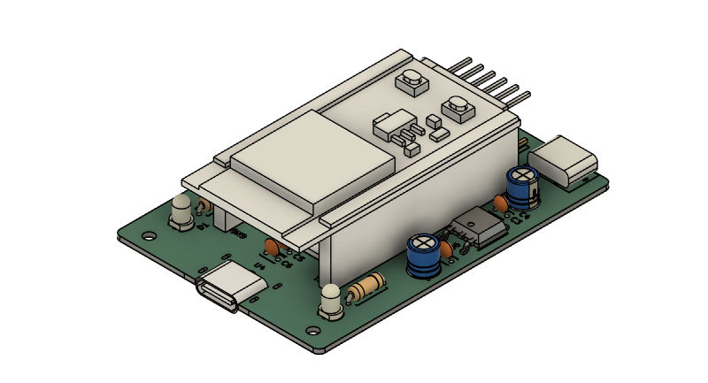
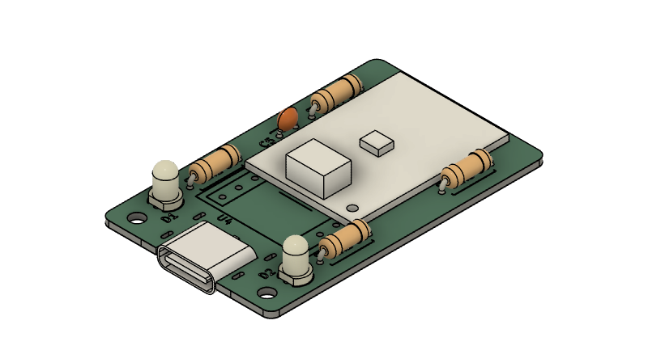
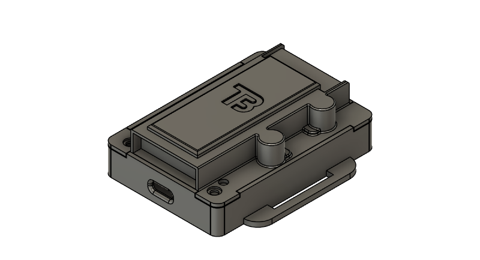
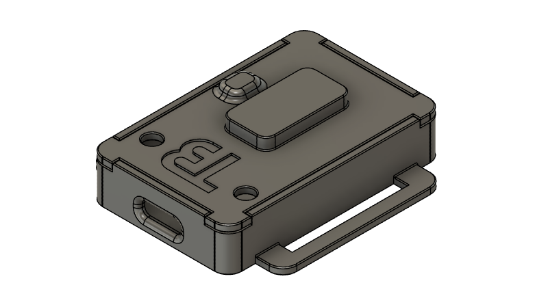
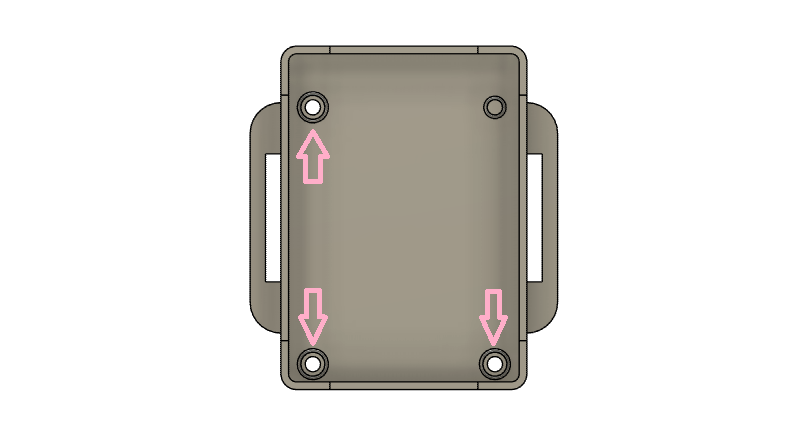
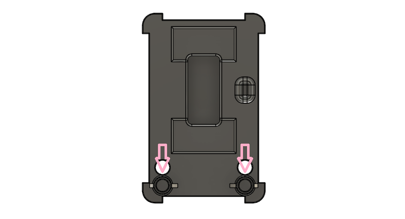
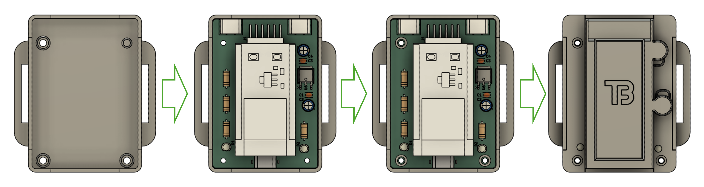
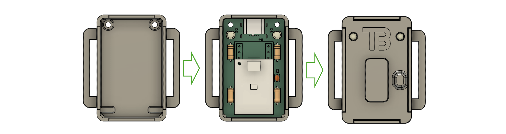
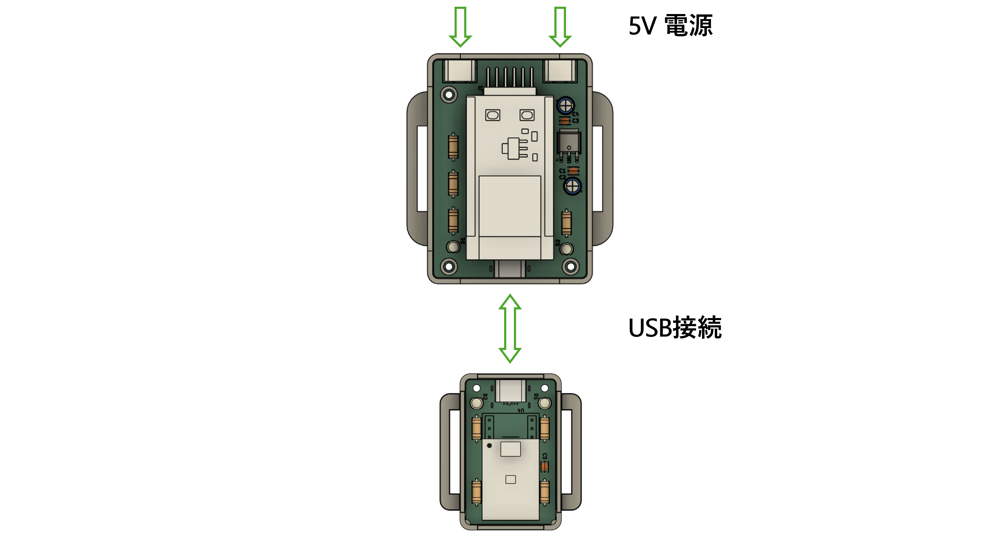
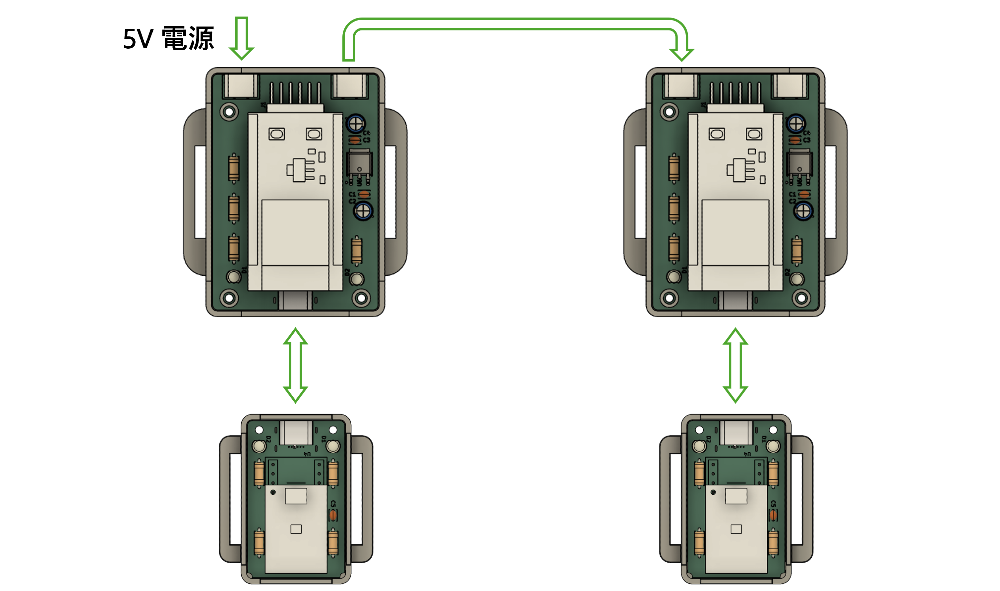

# トラッカーの作り方  
このトラッカーの作り方の手順を説明していきます．  

## 免責  
本ドキュメントに記載されているトラッカーの作成・使用・その他の利用によって生じた全ての損害，損失，トラブル等について，作者は一切の責任を負いません．また，いかなる保証やサポートも提供しません．  
本ツールの利用はすべて利用者自身の判断と責任において行ってください．  

## 必要なもの  
以下の部品を準備します．  
|名称|個数|販売ページ|  
|--|-:|--|  
|ESP32-WROOM-32E|x1|[ESP32-WROOM-32E](https://akizukidenshi.com/catalog/g/g116108/)|  
|LSM6DSV16X|x1|[LSM6DSV16X](https://akizukidenshi.com/catalog/g/g130950/)|  
|ピンソケット 1x16p|x2|-|  
|電源専用USB-Cコネクタ|x2|[電源供給用TypeCコネクタ](https://akizukidenshi.com/catalog/g/g116895/)|  
|USB-Cコネクタ|x2|[ミッドマウントTypeCコネクタ](https://akizukidenshi.com/catalog/g/g113235/)|  
|φ3mm LED VF2.8 20mA|x4|-|  
|3.3V 3端子レギュレーター|x1|[3.3V-1A レギュレーター](https://akizukidenshi.com/catalog/g/g102252/)|  
|カーボン抵抗 1/4W 2kΩ|x4|-|  
|積層セラミックコンデンサ 0.1uF|x5|-|  
|アルミ電解コンデンサ 10uF|x1|-|  
|アルミ電解コンデンサ 47uF|x1|-|  

### PCB基板  
PCB基板を発注し，用意してください．  
必要数は，1セットそれぞれ1枚ずつです．  

- [マスターpcbデータ](../pcb/master/)  
- [スレーブpcbデータ](../pcb/slave_2.1/)  

それぞれにあるzipファイルへガーバーデータが入っています．JLCPCBへ発注する前提でデザインルールを設定しガーバーデータを生成したので，他へ発注する場合はガーバーデータの出力から行ってください．  

## 基板製作  
各PCB基板へ部品を取り付けます．  
### マスター基板  
  

各部品を付ける場所は以下の通りです．  
|場所|部品名|  
|--|--|  
|C1, C3, C5, C6|0.1uf 積層セラミックコンデンサ|  
|C2|47uF アルミ電解コンデンサ|  
|C4|10uF アルミ電解コンデンサ|  
|U1横の16ピン|ピンソケット 1x16p|  
|GND横の16ピン|ピンソケット 1x16p|  
|U2|LSM6DSV16X|  
|U3, U5|電源専用USB-Cコネクタ|  
|U4|USB-Cコネクタ|  
|U6|3.3V 3端子レギュレーター|  
|D1, D2|φ3mm LED VF2.8 20mA|  
|R1, R2|カーボン抵抗 1/4W 2kΩ|  

LEDの色を2色用意した場合は，D1が電源，D2が処理ステータスのLEDになっています．スレーブと合わせて取り付けてください．  

U4から取り付けることを強く推奨します．  
極性等に気を付けて取り付けてください．  
J1, R3, R4は使用しません．  

**⚠注意⚠**  
U2は，トラッカーを身に着ける向きに応じて取り付ける位置が変わります．  
LSM6DSV16Xモジュール基盤の白いコネクタが付いているほうを，身に着けるときの上側にして取り付けます．  
センサーモジュールのコネクタの位置を，基板上の白く塗りつぶされている位置に合わせてください．  

### スレーブ基板  
  
|場所|部品名|  
|--|--|  
|C5|0.1uf 積層セラミックコンデンサ|  
|U2|LSM6DSV16X|  
|U4|USB-Cコネクタ|  
|D1, D2|φ3mm LED VF2.8 20mA|  
|R1, R2|カーボン抵抗 1/4W 2kΩ|  

LEDの色は，マスターと同じくD1が電源，D2が処理ステータスのLEDです．  

**⚠注意⚠**  
U2は，こちらも同じくトラッカーを身に着ける向きに応じて取り付ける位置が変わります．  
LSM6DSV16Xモジュール基盤の白いコネクタが付いているほうを，身に着けるときの上側にして取り付けます．  
センサーモジュールのコネクタの位置を，基板上の白く塗りつぶされている位置に合わせてください．  

## ケース製作  
基板を収めるケースを製作します．  
3Dプリンターで製作します．  
- [マスターSTLファイル](../case/master/)  
  
- [スレーブSTLファイル](../case/slave/)  
  

### マスター  
必要数は以下の通りです．  
|ファイル|個数|  
|--|--|  
|[box.stl](../case/master/box.stl)|x1|  
|[lid.stl](../case/master/lid.stl)|x1|  
|[spacer.stl](../case/master/spacer.stl)|x3|  

印刷後，box.stlの図で示されている穴3か所にインサートナットを挿入してください．  
  
M2のネジを使用するので，それに合わせてください．  

### スレーブ  
必要数は以下の通りです．  
|ファイル|個数|  
|--|--|  
|[box.stl](../case/slave/box.stl)|x1|  
|[lid.stl](../case/slave/lid.stl)|x1|  

印刷後，lid.stlの図で示されている穴2か所にインサートナットを挿入してください．  
  
マスターと同じくM2のネジを使用するので，それに合わせてください．  

## プログラムの書き込み  
ESP32へプログラムの書き込みを行います．  
### 設定  
プログラムを書き込む前に，ネットワーク設定を行います．  
プログラムファイルは[ここ](../prg/Firmware/BT_v4/)にあります．  
この中にある **Network_ConnectionInfo_sample.h** を変更します．  
自身の使用環境に合わせ，SSID, PASS, サーバーIPアドレスを設定してください．  
設定を行う前に，サーバーを動かすPCのIPアドレスを固定しておくことを強く推奨します．  
```cpp  
/* prg/Firmware/BT_v4/src/Network_ConnectionInfo_sample.h */  

namespace Network_ConnectionInfo{  
  inline constexpr char* WiFi_SSID = "";      // WiFi-SSID  
  inline constexpr char* WiFi_PASS = "";      // WiFi-PASS  
  inline constexpr char* SERVER_ADDR = "";    // SlimeVR-IPAddress  
  inline constexpr int   SERVER_PORT = 6969;  // SlimeVR-port  
}  
```  
設定が完了したら，ファイル名を **Network_ConnectionInfo.h** に変更してください．  
**名前の変更をしないと，コンパイル時にファイルが読み込まれずコンパイルエラーとなります．**  

### 書き込み  
シリアル変換モジュール等を使い，ArduinoIDEからプログラムを書き込みます．  
書き込むプログラムは，[ここ](../prg/Firmware/BT_v4/)にある **BT_v4.ino** です．  

**⚠注意⚠**  
**ESP32をマスター基板に取り付けた状態でシリアル変換モジュールを接続しないでください．**  
**レギュレーターへ3.3Vが逆流するため，レギュレーターが故障する可能性があります．**  

## 組み立て  
書き込みが終了したら，組み立てを行います．  

### マスター  
  
1. マスター基板にESP32をセットします．  
電源供給用TypeCポートがある方にESP32の書き込みコネクタが来るように差し込んでください．  
2. box.stlへ基板をはめ込みます．  
3. USBのポート数とケースに開いている穴の数を合わせてはめ込んでください．  
4. はめ込んだら，ねじ穴の3か所にspacer.stlを置きます．  
5. 蓋をかぶせます．  
6. 穴3か所を上からネジで止めます．  
M2のネジを使用します．ちょうど良い長さのものを選んでください．  

### スレーブ  
  
1. box.stlへ基板をはめ込みます．  
ポートの向きに注意してください．  
2. 蓋をかぶせます．  
3. 穴2か所を下からネジで止めます．  
マスターと同じくM2のネジを使用します．  

## 接続  
  
マスターとスレーブをCtoCケーブルで接続します．  
接続ケーブルは，USB3.2-Gen1以上の規格を推奨します．(USB3.0も対応しているとは思いますが，未検証です．)  
マスター基板の電源ポートに，5Vの電源を接続します．  
**PD対応のモバイルバッテリー等では電源の供給が出来ない可能性があります．Type-Aポートからの給電を推奨します．**  

電源スイッチがない為，電源ケーブルを接続した時点で電源が入りプログラムが走り始めます．  

### **⚠注意⚠**  
**マスターとスレーブを接続するTypeCポートは，これらの接続以外の接続は行わないでください．**  
**これらのポートの電源電圧は 3.3V です．もし誤って接続してしまった場合，過電圧によりマイコン・センサー・レギュレーターの故障に繋がります．**  
**また，コネクタとしてTypeCを使用しているだけであり通信規格は別物であるため，電源機器等の誤作動につながる可能性があります．**  

マスターとスレーブのケーブルには差し込む方向があります．間違っている場合はスレーブのステータスLEDが点灯するので，点灯していたら通信ケーブルのどちらかのコネクタを逆向きにして接続しなおし，電源を入れなおしてください．  

### 電源の共有について  
  
電源ポートは内部で接続されており，電源を接続したポートではないほうのポートを別のマスターに接続することで，電源を共有することができます．  
そのため，このトラッカーセットを複数製作し接続することで，複数個所のトラッキングを１つの電源で行うことができます．  
（その分必要な電源容量が増加します）  

## 装着  
トラッカーは，ゴムバンド等を使用して装着します．  
100円ショップ等で販売されているゴムバンドが使用できると思います．  
ケースの両サイドにある四角の穴に通して使用するので，サイズが合うものを選んでください．  

## 利用時の注意点  
### 電源容量  
推奨電源は1セットにつき **2.5W 5V-500mA** です．  
レギュレーターの入力電圧は最大10Vまでサポートしますが，USB接続なので推奨は5Vです．  
使用するトラッカーの個数に合わせた電源を用意してください．  

### ケーブルの接続  
[接続セクション](#接続)でも記述しましたが，接続場所を誤ると，故障や発熱につながる恐れがあります．間違えないように気を付けてください．